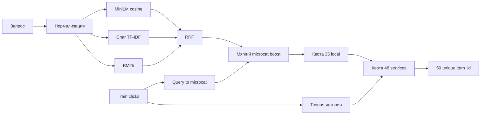

# Avito NLP Candidate Generation
Гибридная система кандидатогенерации для поиска услуг Авито. Для каждого
benchmark-запроса решение возвращает 50 уникальных `item_id`.

## Архитектура



### Поисковые каналы

| Канал | Текст объявления | Задача |
|---|---|---|
| BM25 | `title × 2 + params + 300 символов description` | Точные термины и фразы |
| Char TF-IDF | `title + params` | Опечатки и морфология |
| MiniLM | `title + params` | Семантически близкие формулировки |

Используется open-source модель
[`sentence-transformers/paraphrase-multilingual-MiniLM-L12-v2`](https://huggingface.co/sentence-transformers/paraphrase-multilingual-MiniLM-L12-v2).
Она не дообучается. MiniLM выбрана вместо BGE-M3, потому что быстрее и
требует меньше памяти, что важно для локального CPU-запуска.

### Предсказание микрокатегории

1. Из train собираются три наиболее частые `item_microcat_id` каждого запроса.
2. Для точного повтора benchmark-запроса берутся его train-микрокатегории.
3. Для нового запроса ищутся 20 ближайших train-запросов по char TF-IDF.
4. Их голоса суммируются с учётом similarity.
5. Кандидаты трёх лучших микрокатегорий получают множители `1.45`, `1.25` и `1.10`.

Используется мягкое усиление, а не фильтр: ошибка предсказания не должна
удалить релевантное объявление из топа.

### Квоты

Финальный отбор идёт по шагам:

1. До 10 точных исторических кликов.
2. До 35 локальных объявлений из категории услуг.
3. Не менее 48 объявлений `item_category_id == 114`.
4. Дозаполнение до 50 лучшими глобальными кандидатами.

Категория услуг имеет приоритет над локацией: если в локации нет 35 услуг,
локальная квота может быть недобрана. Два глобальных fallback-места страхуют
редкие положительные примеры других категорий.

## Структура проекта

```text
.
├── app/
│   ├── data_io/
│   │   └── data_io.py
│   └── model/
│       ├── __init__.py
│       └── model.py
├── data/
│   ├── train.parquet
│   ├── benchmark_queries.parquet
│   └── benchmark_items.parquet
├── artifacts/
├── output/
├── config.py
├── main.py
├── requirements.txt
├── Dockerfile
└── README.md
```

## Локальный запуск

```bash
python3.12 -m venv .venv
source .venv/bin/activate
python -m pip install -r requirements.txt
python main.py
```

Первый запуск скачивает MiniLM. После этого модель сначала загружается из
локального кеша без сетевых запросов. Для строго offline-режима можно изменить
создание модели:

```python
model = CandidateModel(local_files_only=True)
```

## Запуск Docker

```bash
docker build -t avito-nlp .

mkdir -p output artifacts

docker run --rm \
  -v "$(pwd)/data:/app/data:ro" \
  -v "$(pwd)/output:/app/output" \
  -v "$(pwd)/artifacts:/app/artifacts" \
  avito-nlp
```

В Docker каталог `artifacts` обязательно нужно монтировать как volume. Иначе кеш
будет потерян после завершения контейнера.

## Кеш

```text
artifacts/
├── huggingface/
├── item_embeddings_f9fc7e6f31.npy
└── item_embeddings_f9fc7e6f31.json
```

V2 использует тот же MiniLM-текст `title + params`, что и baseline 0.54, поэтому
существующая матрица эмбеддингов переиспользуется. Fingerprint меняется, если
изменится модель, порядок `item_id` или dense-тексты. BM25, char TF-IDF и индекс
train-запросов пока строятся заново при каждом запуске.

## Результат

После запуска создаётся `output/answer.csv` с двумя колонками:

```csv
query_id,answer
00WuFMaXSFZBxSzT,1382564bf8994a83 121fa7f5e765ce00
```

- `query_id` — идентификатор benchmark-запроса;
- `answer` — 50 уникальных `item_id`, разделённых пробелами.
