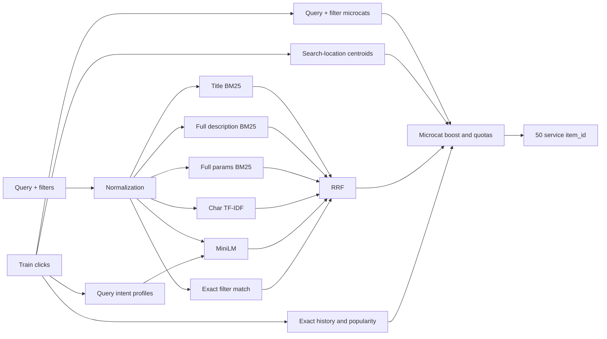

# Avito NLP Candidate Generation

### Профиль намерения запроса

Один короткий запрос часто неоднозначен, а train уже содержит объявления,
которые пользователи выбирали по этому запросу. V4 строит для каждого
нормализованного train-запроса компактный профиль из заголовков и параметров
трёх наиболее часто выбранных объявлений.

Для известного запроса используется его собственный профиль. Для нового —
профиль ближайшего train-запроса по character TF-IDF. Исходный текст запроса
всегда добавляется в начало, чтобы соседний запрос не изменил намерение
полностью. Профиль кодируется тем же MiniLM и образует отдельный dense-канал.

Для него зарезервировано до шести мест, но остальные каналы по-прежнему могут
заполнить весь топ-50. Поэтому профиль помогает раскрыть короткий запрос и не
становится жёстким ограничением.

### Точное сопоставление фильтров

`search_infm_params_text` — это не обычное описание, а выбранные пользователем
структурированные фильтры. V4 удаляет из него служебные слова (`вид`, `тип`,
`услуга`) и находит объявления, в полных `item_infm_params_text` которых есть
все оставшиеся токены.

Совпавшие объявления получают собственный RRF-канал и до десяти защищённых
мест. Если фильтр пуст, содержит неизвестные токены или не дал совпадений,
алгоритм просто возвращается к каналам V3. Для реализации повторно используется
уже построенная матрица Params BM25, поэтому новый разреженный индекс не нужен.

### Географический поиск

Точное равенство `search_location_id == item_location_id` покрывает примерно
83% положительных строк, но 93.4% выбранных объявлений находятся не дальше
25 км от центра поисковой локации. Причина — районы, пригороды и родительские
города могут иметь разные идентификаторы.

Для каждого `search_location_id` модель рассчитывает медианные координаты выбранных
в train объявлений. Затем для запроса формируется geo-пул в радиусе 25 км. Если
объявлений мало, радиус расширяется до 50 и 100 км.

Geo-квота адаптируется по двум статистикам:

- доля близких кликов конкретной поисковой локации;
- доля близких кликов предсказанных микрокатегорий.

Квота ограничена диапазоном 32–45. Несколько глобальных мест сохраняются для
удалённых услуг и ошибок географического прогноза.

### Микрокатегория по запросу и фильтрам

V2 использовала только `search_query`. Начиная с V3 объединяются три распределения:

```text
P(microcat | query)
P(microcat | search_infm_params_text)
P(microcat | query, search_infm_params_text)
```

Для нового запроса по-прежнему используются ближайшие train-запросы по
character TF-IDF. На отложенных запросах union top-5 по query и filters покрывал
98.3% положительных строк с непустым фильтром.

Предсказание применяется дважды:

1. как мягкий множитель RRF-score;
2. как квота внутри географического пула.

Это сохраняет полноту: ошибочная микрокатегория не становится жёстким фильтром.

### Fielded BM25

Поля объявления теперь не склеиваются в один документ:

| Канал | Индексируемый текст | Обоснование |
|---|---|---|
| Title BM25 | полный заголовок, word 1–2 grams | короткий и точный сигнал |
| Description BM25 | полное описание, word unigrams | 29.8% полных token-match появляются после первых 300 символов |
| Params BM25 | полные параметры, word unigrams | фильтры пользователя почти всегда находятся в параметрах |
| Char TF-IDF | title + первые 500 символов params | опечатки и формы слов без дублирования полного params |
| MiniLM | title + первые 500 символов params | семантическая близость и совместимость с кешем V2 |

Раздельные индексы не позволяют длинному описанию уменьшить вес точного
совпадения в заголовке.

### Качество объявления

В V2 число отзывов имело практически нулевой вес. Модель использует небольшой
сглаженный prior, состоящий из:

- percentile числа отзывов внутри `item_microcat_id`;
- Bayesian rating с prior в 20 отзывов;
- `log1p` исторического числа кликов объявления;
- доступности телефона и сообщений;
- ценового percentile внутри микрокатегории.

Quality prior намного слабее текстового RRF. Он меняет выбор только среди
похожих по смыслу кандидатов.

### Только категория услуг

497 658 из 497 673 положительных train-строк относятся к
`item_category_id == 114`. Среди train-кликов по объявлениям актуального
benchmark-корпуса доля категории `114` фактически равна 100%.

Поэтому V4 возвращает все 50 кандидатов из категории `114`. Два прежних
fallback-места для других категорий удалены как категориальный шум.

## Архитектура



## Совместимость с проектом

Для запуска V4 достаточно заменить:

```text
app/model/model.py
```

на приложенный `model.py`. Интерфейс не изменился:

```python
model = CandidateModel()
model.fit(train, items)
predictions = model.predict(queries)
```

`main.py`, `data_io.py`, `config.py`, `requirements.txt` и Dockerfile менять не
нужно. Используются только уже установленные NumPy, pandas, SciPy,
scikit-learn и sentence-transformers.

## Запуск

```bash
source .venv/bin/activate
python main.py
```

или через Docker:

```bash
docker build -t avito-nlp .

docker run --rm \
  -v "$(pwd)/data:/app/data:ro" \
  -v "$(pwd)/output:/app/output" \
  -v "$(pwd)/artifacts:/app/artifacts" \
  avito-nlp
```

## Кеш MiniLM

Dense-текст объявлений и модель совпадают с V2/V3, поэтому используется прежний файл:

```text
artifacts/item_embeddings_f9fc7e6f31.npy
```

При совпадении fingerprint эмбеддинги объявлений не пересчитываются. Профили
запросов кодируются во время `predict()` одним небольшим батчем. Разреженные
BM25 и TF-IDF индексы пока строятся при каждом запуске.

## Время и память

На локальном CPU полный `fit()` smoke-теста занял 303.7 секунды (около пяти
минут), а четыре контрольных запроса — 8.2 секунды. Основное время уходит на
индексацию полного описания и параметров. Профили строятся обычной агрегацией
train и почти не увеличивают память. Повторный расчёт MiniLM для объявлений при
существующем кеше не выполняется.

## Проверки

Проведён end-to-end smoke-тест на реальных parquet-файлах:

- модель загрузила существующий кеш MiniLM;
- запросы с существующей и отсутствующей точной item-location обработаны;
- каждый ответ содержит 50 уникальных `item_id`;
- все кандидаты существуют в benchmark-корпусе;
- все кандидаты имеют `item_category_id == 114`;
- для непустых фильтров проверено формирование точного filter-пула;
- для известных и новых запросов проверено формирование intent-профиля;
- для запросов без точной item-location geo-квота действительно заполнилась
  объявлениями в ближайшем радиусе.

## Что намеренно не добавлено

V4 не включает CatBoost/LightGBM и не дообучает bi-encoder. Эти изменения
существенно усложнили бы воспроизводимость и потребовали корректной
query-grouped валидации. Сначала benchmark-отправка должна отдельно измерить
эффект двух новых генераторов; обучаемый отбор стоит добавлять после фиксации
нового candidate pool.
